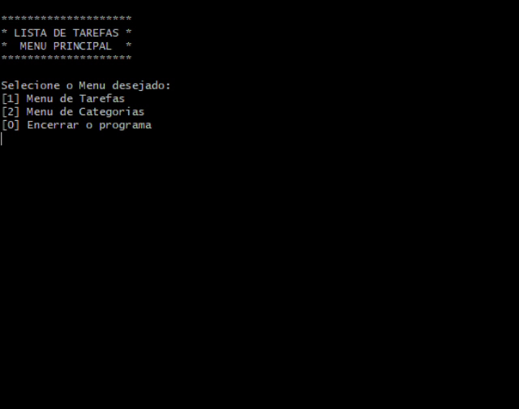
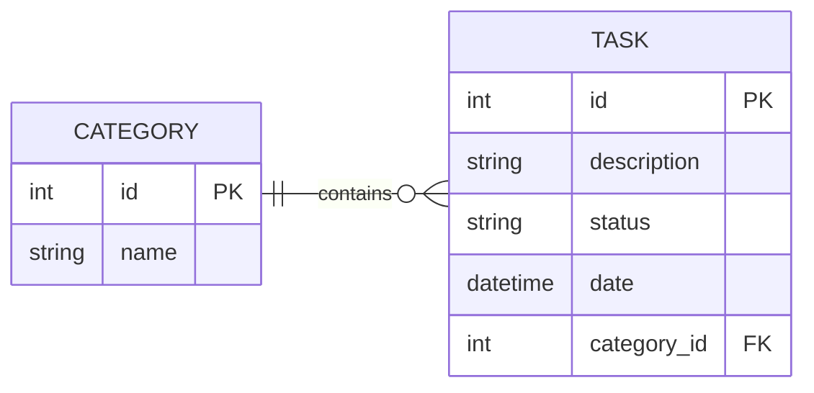

<p align="center">
  
  
  
  
</p>
<h1 align="center">📋 Lista de Tarefas 📅</h1>

## ℹ️ Sobre o Projeto
Lista de tarefas desenvolvida em Java, permitindo melhor organização de afazeres. Para criar uma tarefa, é preciso da descrição, status, data e categoria. A categoria deve ser criada separadamente antes da criação da tarefa.

O sistema implementa as funcionalidades CRUD no banco de dados MySQL, armazenando os dados das categorias e das tarefas. A aplicação possui um menu interativo e funciona via CLI (Interface de Linha de Comando).

O Docker cria um container da aplicação, permitindo a sua execução mesmo em máquinas que não possuam Java e/ou MySQL instalados.
### 🎬 Demonstração


### ✨ Funcionalidades do Sistema
- Criar tarefa
- Listar todas as tarefas, por data mais próxima ou por outros filtros
- Atualizar a tarefa
- Excluir uma ou todas as tarefas
- Criar, listar, atualizar e deletar categorias das tarefas

### 🗃️ Arquitetura do banco de dados


### 📂 Estrutura do Projeto
```text
.
├── src/
│   └── main/
│       └── java/
│           └── todolist/
│               ├── conn/         # Conexão com o Banco de Dados
│               ├── controller/   # Valida requisições e envia para o service
│               ├── exceptions/   # Exceções e Validações
│               ├── model/        # Entidades do sistema
│               │   └── enums/    # Tipos enumerados
│               ├── repository/   # Persistência e acesso a dados
│               ├── service/      # Valida regras de negócios e envia para o repository
│               ├── ui/           # Menus da aplicação
│               ├── util/         # Classes utilitárias
│               └── Main.java     # Inicialização da aplicação
├── assets/                       # Mídias para o README
├── logs/                         # Logs do sistema organizados por data
├── docker-compose.yml            # Organização dos containers
├── Dockerfile                    # Criação da imagem da aplicação
├── init.sql                      # Estrutura do Banco de Dados
├── entrypoint.sh                 # Script: Limpa o terminal e inicia a aplicação
├── pom.xml                       # Dependências do Maven
├── .dockerignore                 # Exclusão de arquivos desnecessários na imagem Docker
├── .gitignore
└── README.md
```

### :computer: Tecnologias utilizadas
Este sistema foi desenvolvido com Java e MySQL, sem o uso de frameworks externos. Seguem abaixo alguns dos conceitos aplicados:
- Orientação a Objetos
- Tratamento de Exceções
- JDBC para integração com o Banco de Dados
- Collections, Stream API e Optional
- Estruturação em Camadas (models, controller, service e repository)

Docker foi utilizado para isolar o ambiente da aplicação

## 🚀 Executando a Aplicação
### 🛠️ Pré-requisitos
- **Docker** para containerizar a aplicação.
- **Git** para clonar o repositório.

---
1. **Clone o repositório**
```
git clone https://github.com/alineaos/lista-tarefas.git
```

2. **Navegue até a pasta do repositório**
```
cd lista-tarefas
```

3. **Construa a imagem da aplicação**
```
docker-compose build
```
Prepara o ambiente e instala as dependências necessárias

4. **Execute a aplicação**
```
docker-compose run --rm app
```
```--rm``` permite o uso do CLI da aplicação